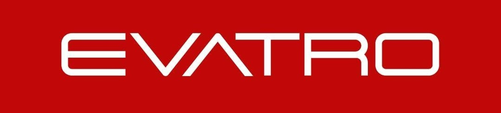
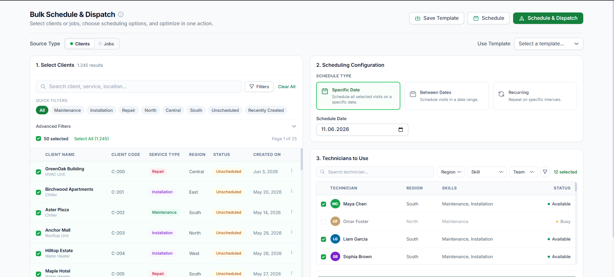

# 📊 Business Analysis Internship Portfolio

**Research · Product Analysis · UI Prototype**

Work produced during my internship at **Evatro**

  

---
## 🛠️ Technical Skills

### 📋 Business Analysis

| Skill | What I did with it |
|-------|--------------------|
| 📝 **Requirements Engineering** | Wrote 7 clear, testable functional requirements (`FR-01` to `FR-07`) |
| 📖 **User Stories** | Turned each requirement into a user story with a clear persona, need, and benefit |
| ✅ **Acceptance Criteria** | Defined 21 measurable **Given / When / Then** conditions |
| 🌳 **Root Cause Analysis** | Used "5 Whys" style chains to separate the symptom from the real cause |
| ⚖️ **Solution Evaluation** | Compared alternatives and justified the recommended one |
| 🎯 **Prioritization** | Ranked findings as Critical / High / Medium by user impact, frequency, and process impact |
| 🔄 **Process Modeling** | Mapped **As-Is → To-Be** flows (YouTube subtitles case study) |
| 🧭 **Change & Quality Thinking** | Applied **INVEST**, impact analysis, and the bug vs. improvement distinction |
| 💬 **Stakeholder Communication** | Adapted the message for business units, developers, and QA |

### 🧪 QA & Test Design

| Skill | What I did with it |
|-------|--------------------|
| 🔬 **Test Case Writing** | Wrote 23 test cases (ID, precondition, steps, expected result) |
| 🔗 **Traceability** | Linked every test case back to its acceptance criteria and requirement |
| ⚠️ **Edge & Negative Cases** | Covered offline sync failure, column-limit overflow, empty states, and edge-of-button taps |
| 👁️ **UX Review** | Evaluated error messages, control visibility, tap targets, and missing guidance |

### ⚛️ Frontend Development (React)

| Skill | What I did with it |
|-------|--------------------|
| 🧩 **React 18 Components** | Built the prototype with function components and reusable UI pieces (icons, inputs, tables) |
| 🪝 **Hooks** | Used `useState`, `useMemo`, `useEffect`, and `useRef` to manage complex UI state |
| 🪜 **Multi-step Flow** | Implemented a state-driven wizard: `Select → Optimizing → Preview → Done` |
| ⚡ **Derived State** | Used memoized filtering, searching, and pagination over **1,245 records** |
| 📋 **Forms & Validation** | Built conditional fields (specific date / range / recurring) with inline validation |
| 🗂️ **Data Modeling** | Generated mock clients, jobs, and 40 technicians with regions, skills, teams, and availability |
| 🗺️ **Inline SVG** | Drew the route preview illustration and icons directly in SVG |

### 🎨 UI & Styling

| Skill | What I did with it |
|-------|--------------------|
| 🌬️ **Tailwind CSS** | Styled the whole UI with utility classes and a custom brand color config |
| 📱 **Responsive Design** | Used breakpoint-based layouts (`sm`, `md`) for desktop and smaller screens |
| 🔤 **Typography** | Applied the Inter font via Google Fonts for a clean, consistent look |
| 🎛️ **Interaction States** | Designed hover, focus, disabled, and empty states for a polished feel |

### 🧰 Stack

---

## 📁 What's Inside

| | Deliverable | What it is |
|---|---|---|
| 📚 | [**Business Analysis Research**](Business_Analysis_Research.pdf) | Core BA concepts + a YouTube subtitles case study |
| 🔎 | [**FieldPie Application Analysis**](docs/FieldPie_Application_Analysis.pdf) | 7 UX findings, from root cause to test case |
| 🖥️ | [**Bulk Schedule & Dispatch**](BulkSchedule.html) | Interactive UI prototype, no build step |

---

## 📚 1. Business Analysis Research

Requirements (business / user / system, functional / non-functional) · Elicitation techniques · As-Is vs To-Be · User Stories & Acceptance Criteria · Use Cases · INVEST · Impact analysis · Bug vs Improvement

**Case study: YouTube subtitles.** Auto-captions exist only in the video's original language. The proposal adds an automatic translation layer so users can watch any video in their own language.

---

## 🔎 2. FieldPie Application Analysis

Every finding goes through the same **10-step loop**:

`Problem` → `Current State` → `User Impact` → `Root Cause` → `Solution` → `Priority` → `Requirement` → `User Story` → `Acceptance Criteria` → `Test Cases`

| # | Finding | Proposed Solution |
|:-:|---------|-------------------|
| 1 | AI chat window blocks the UI it points to | Make the chat window resizable and movable |
| 2 | "Send" and "AI Chat" buttons overlap | Add enough spacing between the two buttons |
| 3 | Chart editor's Save/Cancel buttons hidden below the fold | Pin Save, Cancel, Delete, Clear in a fixed top bar |
| 4 | "Add Table" copies existing data instead of creating an empty table | Create a truly empty table and auto-sync entered data to related modules |
| 5 | Generic "An error occurred." on column selection | Show a specific error naming the failing column(s) |
| 6 | "Auto E-mail" never explains trigger or content | Add an info icon explaining trigger, frequency, and content |
| 7 | "Task" notification filter returns nothing | Fix the mapping between the filter label and the backend category value |

---

## 🖥️ 3. Bulk Schedule & Dispatch Prototype

A single-file prototype for scheduling and dispatching field work in bulk.

- 🔀 **Clients and Jobs** mode
- 🔍 Search, quick filters, advanced filters, pagination
- 📅 **Specific, range, or recurring** schedules
- 👷 Technician picker (region, skill, team, availability)
- 💾 Reusable **templates**
- 🚀 `Select → Optimize → Preview → Schedule / Dispatch`

| 🖥️ | [**Bulk Schedule & Dispatch**](BulkSchedule.html) | Interactive UI prototype, no build step |

  

> ℹ️ Uses mock data and a simulated optimization step. No backend. Internet needed for CDN scripts.

---

## 🧠 Key Learnings

**Requirements writing** · **Root cause analysis** · **Producing solutions** · **Test design** · **React UI prototyping**

---

**Ceren Naz Dervişoğlu** · [LinkedIn](https://www.linkedin.com/in/ceren-naz-dervi%C5%9Fo%C4%9Flu-413b54244/?isSelfProfile=true) 

Internship portfolio. Views are my own, not an official Evatro publication.

